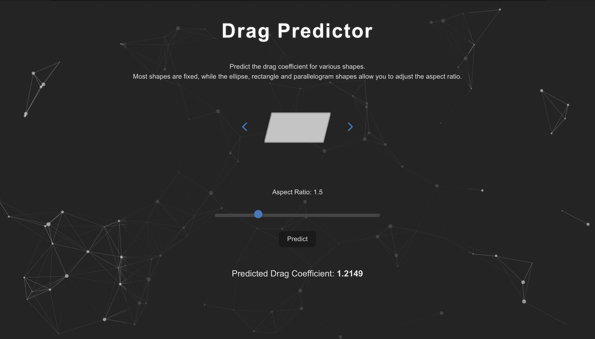

Drag Predictor

Overview -

This app was built as a hands-on project to explore how machine learning can be applied to predicting physical properties — specifically, drag coefficients for 2D shapes. It combines:

A React frontend with SVG-based shape rendering
A Python backend using scikit-learn to train and serve the model
Dynamic shape generation with tunable aspect ratios (e.g. ellipses, rectangles)
A lightweight ML workflow to simulate real-world predictive modeling

The goal was to demonstrate:

Full-stack integration between a modern frontend and a Python ML backend
Interactive visual representation of abstract physics concepts
Practical use of Python for fast scientific prototyping and inference

Frontend -

Built with React
Shape carousel with real-time aspect ratio adjustment
Sends inputs to backend via HTTP POST and displays predicted drag coefficient

Backend -

Python API using a trained ML model (scikit-learn)
Accepts JSON inputs and returns predicted drag values
Simulates basic physics-informed ML inference

Additional Notes -

Aspect ratio is a unitless parameter that defines shape geometry
Demonstrates end-to-end flow: UI → model → prediction
Built for demonstration and learning purposes — not intended for production use
